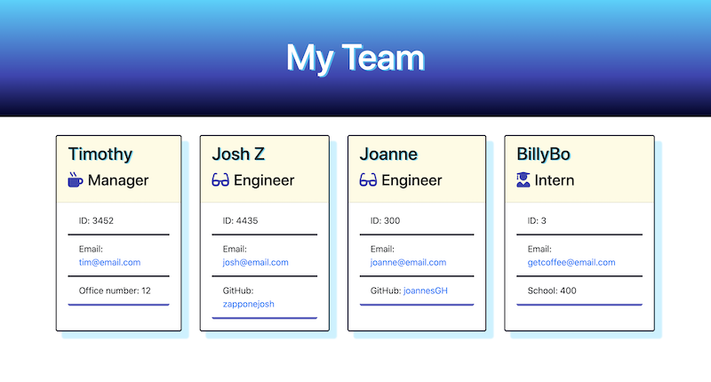

# Team Generator
### Table of contents
* [Tech stack](#tech-stack)
* [Preview](#preview)
* [Deployment](#deployment)
* [Installation and Usage](#installation-and-usage)
* [Testing](#testing)
* [Contact](#contact)
A Node CLI that takes information for a team and outputs a html file that displays member information
## Tech Stack
* Node
* InquirerJS
* Handlebars
* Jest

## Preview


[Watch a demo here](googledrive)

[See the exmple output here](output/test.hmtl)

## Installation and Usage
```npm install```
```npm start```
## Testing
```npm test``` will test the employee classes.
        
## Contact
**Email questions: [zappone.josh@gmail.com](mailto:zappone.josh@gmail.com)**

MIT
